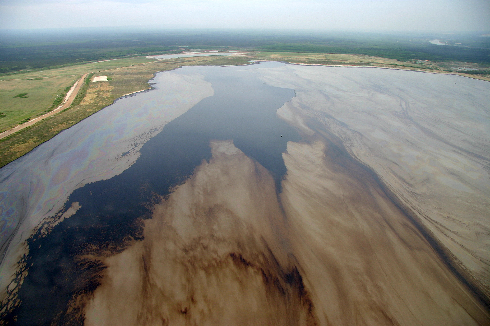
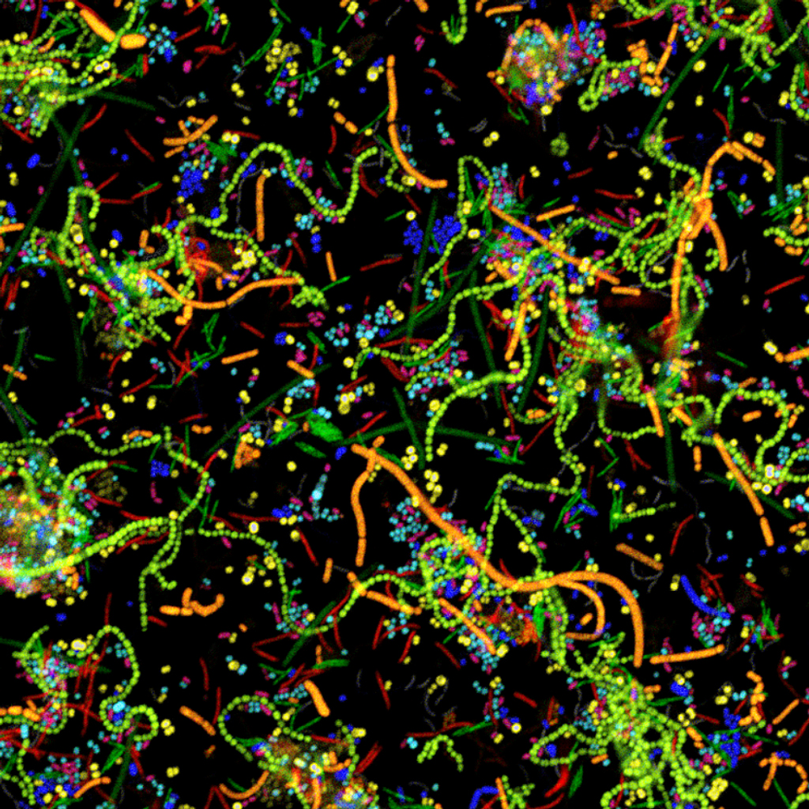
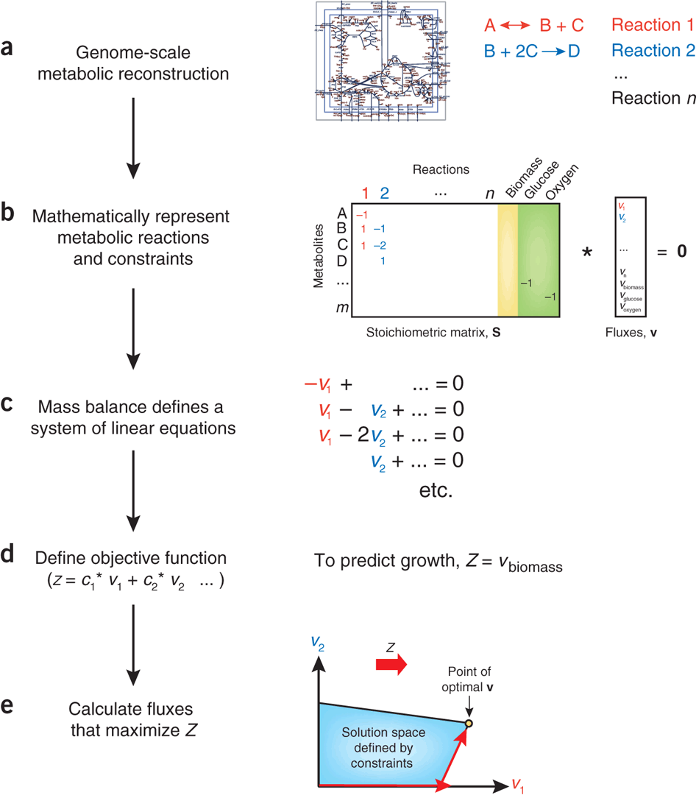

title: Meta Flux - a Web based tool for interactive flux balance analsis
author: iGEM UofT

%%%%%
%% Add some inline style rules...

%css

a {
  color: inherit;
  text-decoration: none;
}

body {
  background-image: url('./img/bg.jpg');
  background-position: center center;
  background-size: 100% auto;
}

.step {
  width: 800px;
  height: 600px;
  padding: 20px;

  font-size: 3em;
  text-align: center;

  opacity: 0.3;
}

.step.active {
  opacity: 1;
}

ul {
    text-align: left;
    font-size: 0.5em;
}

.slide {
  background: rgba(250,250,250,0.9);
  overflow-y: hidden;
}

code {
  background-color: yellow;
  font-size: 14px;
}

.fullWidth {
    width: 100%;
    height: auto;
}

.absHeading {
    position: absolute;
    top: 0%;
    left: 50%;
    transform: translateX(-50%);
}

.vCenter {
    position: absolute;
    top: 50%;
    left: 50%;
    transform: translateY(-50%) translateX(-50%)
}

%end

<!-- bower:js -->
<!-- endbower -->

 

%%%%%%%%%%%%%%%%%%%
%% Here we go...

% 1
!SLIDE slide x=0 y=0
<canvas id="canvas"></canvas>

% 2
!SLIDE slide x=1000 y=0

Tailings Ponds Bioremediation

% 3
!SLIDE slide x=500 y=1000 scale=2

microbial consortia

% 4
%css
#step-5 {
    background: rgba(0,0,0,0)
}
%end
!SLIDE slide x=500 y=2500 scale=3

How do I optimize the biomass of toluene degrading bacteria?

% 5
!SLIDE slide x=2800 y=1500 z=1000 rotate=-90 scale=4

FBA:= Flux Balance Analysis

!SLIDE slide x=3000 y=1500 rotate=-90

wheee
<canvas id="canvas2"></canvas>

%% The End
%%%%%%%%%%%%%%%

